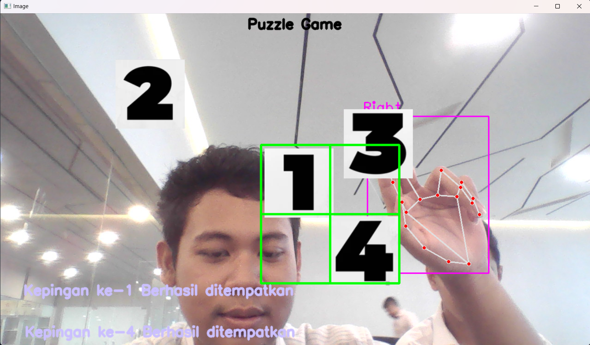

# **Drag & Drop Puzzle with HandTracking**

### Install

After you clone this repository you must install all libraries needed for

```bash
cd ./puzzle-opencvPy
pip install -r requirements.txt
```

### Usage

After all dependencies have been installed and the pieces are available you can run the `main.py` file.

```bash
python main.py
```


